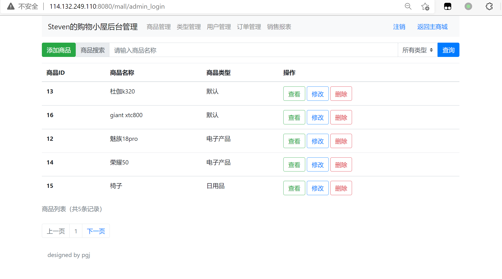

# 购物网站的Servlet+JSP实现

姓名：彭国峻
学号：201930343063
班级：19级计科一班

## 设计思路

本系统基于Servlet和JSP技术设计，采用常见的MVC设计架构，将系统分为几个模块。

## 注册和登录模块

该模块是电子商务网站的一个重要模块，起到判断用户身份的作用。系统采用前后台分离部署的方式，区分了管理员和普通用户的界面，便于做权限区分。普通用户可以直接访问主页，看到登录和注册按钮，点击后显示相应的登录和注册界面。管理员可以通过系统导航栏中的后台登录按钮进入后台界面。普通用户可以用自己的邮箱进行注册和登录，而管理员账户则直接通过后台数据库添加，管理员可以管理产品和用户信息。

## 产品管理模块

产品管理主要包括添加、修改和删除产品。系统使用不同的类别来管理不同的产品。通过点击首页导航栏中的类别按钮，可以查看不同类别的产品。为了方便用户有效地查找产品，系统还包括产品搜索部分，可以通过首页导航栏的搜索框进行关键词搜索。

## 购物流程模块

该模块主要完成电子商务网站的重要环节，包括添加购物车、创建订单、删除订单、进行支付、通知发货、销售报表统计等重要功能，涵盖了用户购物的全过程。用户想购买产品后，可以将其添加到购物车中。在购物车界面，他们可以查看当前所选产品的详细信息和价格。当他们确定要购买时，他们可以选择创建一个订单，创建订单后，他们需要尽快付款。管理员可以在后台取消未付款的订单。当用户付款后，管理员可以根据实际情况通过邮件通知用户发货。系统会统计所有产品的销售量和销售额，方便管理员对产品的销售量进行预测。

## 实验代码

### 数据库

本系统包含七个数据表，其用途如下所述。

* 管理员用户表 `ausertable`。保存管理员帐户和密码。
* 普通用户表 `busertable`：保存普通用户账户密码，用于登录、注册过程。
* 购物车表 `carttable`：保存用户ID，产品ID和产品数量，用于记录用户购物车的内容。
* 商品表 `goodstable`：保存商品价格、名称、类别、图片路径。
* 商品类型表 `goodstype`：保存所有商品类型。
* 订单表 `orderbasetable`。记录用户创建的订单，包括创建订单的用户，时间，是否付款，以及其他信息。
* 订单详情表 `orderdetail`：记录订单详情中包括哪些产品以及相应的数量。

创建数据包的详细SQL语句可以在 `src/main/stevenmall.sql`文件中找到。

### 数据操作

本系统使用基本的JDBC驱动与Mysql进行交互，因此它封装了基本的数据库操作，主要的基本数据操作 `BaseDao`，用户相关的数据操作 `BeforeUserDao`，管理员相关的数据操作 `AdminDao`。具体代码请参考 `src/main/java/dao`文件夹。

考虑到可能有多个用户同时操作，系统设计了一个数据库连接池，每个连接都优先于连接池中的现有连接，如果连接池中没有连接，则一次创建多个连接，避免了频繁创建数据库连接。此外，基本的数据查询和更新操作也被封装起来。

### 实体模型

该系统由四个主要的实体模型组成。`AdminDTO`, `UserDTO`, `GoodsDTO`, 和 `GoodsTypeDTO`。实体类是按照Java Bean的相关规范编写的，并与数据表中的数据项相对应，便于使用。具体代码请参考 `src/main/java/dto`文件夹下的文件。

### 过滤器

由于有些功能需要识别用户，如未登录的用户不能注册，所以对URL的识别要有权限。本系统使用两个过滤器分别进行编码转换和URL识别。本系统对文件编码采用UTF-8编码，对前/后交互文本编码采用UTF-8编码。

URL过滤主要分为以下几个部分。

1. 静态资源：如图片文件、css样式文件、js脚本文件、默认发布。
2. 后台JSP文件请求，登录页面发布后，其他页面需要判断是否在后台登录。
3. 前端JSP文件请求，登录、注册、搜索页面被释放，其他页面需要判断是否是前台登录。
4. 前台servlet请求，用于登录、注册、产品信息、搜索的servlet发布，其他判断需要确定前台是否登录。
5. 后台servlet请求，用于登录servlet的发布，其他判断后台是否登录。

详细的过滤器代码参考 `src/main/java/filters`文件夹中的代码。

### 服务层

根据MVC模式的架构，需要在实体的基础上封装一个服务层。本系统的服务分为两个服务，对于用户服务 `BeforeUserService`，主要提供用户注册、登录、查询商品、修改购物车等功能。对于管理员服务 `AdminService`，主要提供管理员登录、产品管理、类型管理、用户管理、订单管理、销售报表等功能。详细的服务代码请参考 `src/main/java/service`文件夹中的代码。

### Servlet

Servlet是本系统的主要部分，它通过调用其他部分完成系统功能。整体分为两部分，管理员的Servlet（位于admin文件夹下）和用户的Servlet（位于before文件夹下）。

为了方便配置，本系统的Servlet通过注释的方式配置了URL映射，并使用不同的参数来区分类似的功能。为了提高用户体验，本系统的一些Servlet返回字符串，前端通过ajax请求判断结果，避免页面跳转，提高交互效率。

管理员Servlet包括。添加/修改商品 `AddGoodsServlet`，登录 `AdminLoginServlet`，类型管理 `AdminType`，删除商品 `DeleteGoodsServlet`，产品详情 `DetailServlet`，注销 `LoginOutServlet`，订单管理 `OrderManagerServlet`，产品查询 `SelectGoodsServlet`，用户管理 `UserManagerServlet`。

UserServlet包括。获取产品细节 `BeforeDetailServlet`, 删除购物车 `DeleteCartServlet`, 获取产品列表 `FirstServlet`, 订单提交 `OrderSubmitServlet`, 付款 `PayServlet`, 放入购物车 `PutCartServlet`, 注册 `RegisterServlet`。搜索产品 `SearchServlet`, 查询购物车 `SelectCartServlet`, 更新购物车 `UpdateCartServlet`, 用户中心查询订单 `UserCenterServlet`, 登录 `UserLoginServlet`, 退出 `UserLogoutServlet`。

详细的Servlet代码请参考 `src/main/java/servlet`文件夹下的代码。

### 工具

本系统的主要工具类是 `MallProp`、`SendEmail`、`UploadDown`、`UploadDown`和 `MyUtil`。详细代码请参考 `src/main/java/util`文件夹中的代码。

### 前端

系统的前端主要使用JSP技术，也分为两部分，一般用户界面（位于 `beforeUser`文件夹下），管理员用户界面（位于 `admin`文件夹下）。该系统主要采用 `Bootstrap`样式库设计，以达到良好的用户体验。详细代码请参考 `src/main/java/webapp`文件夹下的代码。

### 其他

为了方便开发和部署测试，本系统使用集成开发环境Intellj IDEA开发。使用Maven进行依赖性管理，并将配置文件单独分开。使用log4j2进行日志输出。

## 功能测试

系统主页访问：


注册功能：


登录界面：


登录成功的屏幕，按类别搜索产品：


搜索产品：


产品详细信息屏幕。


购物车界面：


结账界面。


订单提交界面：


用户中心检查订单：


后台登录界面。


后台产品管理： !



添加商品接口： 


类型管理：


用户管理：


订单管理：


发送通知邮件：


邮件接收：


经过详细测试，本系统基本功能完善，页面美观实用，交互体验良好。

## 应用程序的部署

部署本系统需要以下步骤。

1. 安装JDK8、Tomcat8、Mysql8环境。
2. 创建Mysql数据库和数据表。参考 `src/main/stevenmall.sql`文件。3.
3. 在 `src/main/resources`文件夹下创建一个配置文件 ``mall.properties``，其内容类似于以下。

```properties
# steven's shopping lodge 配置文件

# 数据库配置
database.user=steven
database.password=密码
database.name=javaweb

# 邮箱配置
mail.smtp.host=smtp.qq.com
mail.smtp.auth=true
mail.username=gjpeng-0419@foxmail.com
mail.password=PaSsWoRd
mail.smtp.port=465
mail.smtp.ssl.enable=true
```

4. 编译源代码，将构建的war包命名为 `mall.war`上传到Tomcat的webapps目录下。
